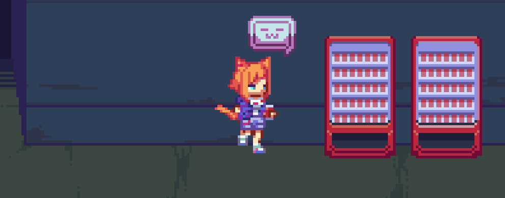

# Hey there ˙ᵕ˙

## ╰┈➤ Software Technology Engineer that loves game development  

> [!IMPORTANT]
>  ➤   Cats addicted 
>  ➤   Nintendo Lover 
>  ➤  Anime enthusiast
>  ➤ Pixel Artist 

## Objectives
Take advantage of all the opportunities to learn, accepting the challenges that may arise to improve and acumulate more experience.

 

### Languages and Tools 

   

# Pixel Artist

